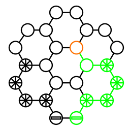
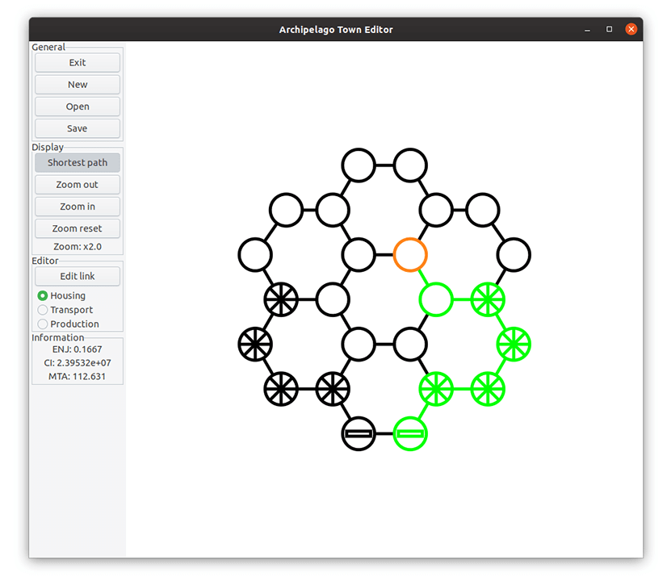

<!-- PROJECT LOGO -->
<br />
<p align="center">
  <a href="https://github.com/MarcusCemes/archipelago">
    
  </a>

  <h3 align="center">Archipelago</h3>

  <p align="center">
    An EPFL MT-BA2 C++ programming project
  </p>
</p>

<!-- ABOUT THE PROJECT -->
## About The Project

Due to a sharp increase in sea levels, a city state wishes to transform into a floating city, consisting of floating districts and sky bridges. This tool assists the city design process, providing useful global statistics and an extensible model for simulation.

This is a C++11 programming module based around the GTKmm framework's event loop.

### Built With

* g++
* make
* [GTKmm](https://gtkmm.org/en/)


<!-- GETTING STARTED -->
## Getting Started

<p align="center">
  
  <br />
  <sub><i>The archipelago graphical user interface</i></sub>
  <br />
</p>

To get a local copy up and running follow these simple steps. We recommend Ubuntu, although this software should work on any GTK supported platform (in theory).

### Prerequisites

You will need
* g++
* make
* GTKmm 3
```sh
sudo apt update
sudo apt install g++ make libgtkmm-3.0-dev
```

### Installation

1. Clone the archipelago repository
```sh
git clone https://github.com/MarcusCemes/archipelago.git
```
2. Build using the Makefile
```sh
make
```

This will produce an `archipelago` executable under the `dist` folder. If you wish to run the software on another system apart from the one you used to build the software, you may need to install the lighter end-user GTKmm library (the `dev` version above is sufficient).

```sh
sudo apt update
sudo apt install libgtkmm-3.0-1v5
```

<!-- USAGE EXAMPLES -->
## Usage

The program may either be run directly or using the command line. An additional path may be specified to immediately attempt to load that saved town.

```sh
dist/archipelago test/tests/g01.txt
```

The interface provides graphical tools to interact with the town. There are three different node types, housing, transport and production, connecting together by links.

Nodes may be selected/deselected. With no nodes selected, clicking on empty space will create a new node, clicking again on a selected node will remove it, right clicking somewhere with a node selected will move that node, and click-and-dragging outside of a selected node will modify it's capacity (resize). To create a link, active the `Edit link` button, select a node, and then select another node.

A link connection between two transport nodes has a faster transit speed. Production nodes may not be traversed to gain access to other nodes. By activating the `Shortest path` option, a green path will be highlighted showing the optimal route from a selected housing node to the closest production node *and* to the closest transport node. This feature implements a modified implementation of [Dijkstra's algorithm](https://en.wikipedia.org/wiki/Dijkstra%27s_algorithm).

To assist with city evaluation, three town criteria are calculated:

- **ENJ** (*Equilibre Nuit-Jour*): The balance between housing capacity and production capacity
- **CI** (*Coût de l'Infrastructure*): The estimated cost of the city
- **MTA** (*Meilleur Temps d'Accèss*): The average travel time for any housing node the closest production node

The town may be loaded from and saved to files using a unique file format. Calculations are done using double-precision floating point numbers.

## Architecture

The application is split into an MVC-style (Model-View-Controller) architecture. The model is independent of GTKmm.

- **Controller**: The GUI module
- **View**: The Graphics module
- **Model**: The Town and Node modules

<!-- LICENSE -->
## License

Distributed under the MIT License. See `LICENSE` for more information.

The Archipelago project concept is copyright © Ronin Boulic & collaborators.
